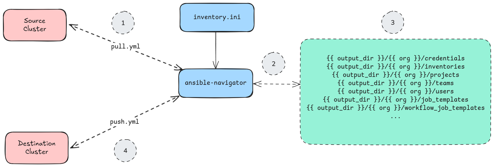

# README: `aap-data-migrate`

This repository contains an examples of how you can migrate objects from one
Ansible Automation Platform environment to another.

## Workflow



## Quick-Start

Clone this repository.

Install dependencies.

```bash
python3 -m pip install requirements.txt
```

Build execution environment(s).

For Ansible Tower 3.8:

```bash
ansible-builder build --build-arg AH_TOKEN=<YOUR_HUB_TOKEN> -t example.com/user/tower:tag -f execution-environment/execution-environment-tower.yml -v=3
```

For Automation Controller 4.5:

```bash
ansible-builder build --build-arg AH_TOKEN=<YOUR_HUB_TOKEN> -t example.com/user/controller:tag -f execution-environment/execution-environment-controller.yml -v=3
```

Copy `inventory.ini.example` to `inventory.ini` and update with source and destination environment details.

```ini
[source_cluster]
source

[source_cluster:vars]
ansible_connection=local
controller_username=admin
controller_password=admin123!
controller_hostname=tower.example.com
controller_validate_certs=true
controller_api_plugin=awx.awx

[dest_cluster]
dest

[dest_cluster:vars]
ansible_connection=local
controller_username=admin
controller_password=admin123!
controller_hostname=controller.example.com
controller_validate_certs=true
controller_api_plugin=ansible.controller

[all:vars]
output_path=/tmp/export
```

Read and save object definitions from source cluster.

```bash
ansible-navigator run pull.yml --eei example.com/user/tower:tag -i inventory.ini
```

To limit to objects owned by a specific organization, you can use the `organization_filter` or `organization_id` var.

```bash
ansible-navigator run pull.yml --eei example.com/user/tower:tag -i inventory.ini -e organization_filter='MyOrg'
```

Make modifications to objects as needed (e.g. credentials will not contain values for their secret fields). You will find 
variable files with these object definitions stored under `${PROJECT_ROOT}/export/{ORG_NAME}`. 

Push objects owned by the organization named `$ORG_NAME` out to destination cluster.

```bash
ansible-navigator run push.yml --eei example.com/user/controller:tag -i inventory.ini -e orgs=$ORG_NAME
```

## Repo Contents

### `inventory.ini`

Ansible inventory file. Contains two host groups - `source_cluster` and `dest_cluster`.

The `source_cluster` identifies connection details for the cluster that contains the objects
you are looking to import or capture.

The `dest_cluster` identifies connection details for the cluster that you would like to push
objects to.

The `output_path` variable identifies where in the EE the captured objects should be written/read from.

### `ansible-navigator.yml`

Configuration file for how `ansible-navigator` should behave. The primary thing worth
mentioning in this file is the `volume-mounts` section. This is used to bind mount a host
directory into the running job (i.e. container) so that objects will persist beyond the
lifecycle of job itself.

### `pull.yml`

Playbook that will make API calls to the inventory `source_cluster` to retrieve definitions for
objects such as:

* credentials (**without the secret fields**)
* job templates
* workflow job templates
* schedules
* projects
* inventories
* and more...

These objects are written to the filesystem of the EE (which in turn is mounted on the host via
the `volume-mounts` section in `ansible-navigator.yml` mentioned above).

After these objects are retrieved and written to disk, you will need to make modifications. 
One such example would be to add the secret fields to credentials. Other modifications may be
necessary depending on versions of the collections, Tower, and Automation Controller that are in play.

### `push.yml`

Playbook that will iterate over the local filesystem hierarchy that contains the object definitions
created by `import.yml`, and make API calls to the `dest_cluster` to ensure those objects are at their
desired state in the target environment.

## Additional Resources

Certified collections for interacting with Ansible Automation Platform components:

* [ansible.platform](https://console.redhat.com/ansible/automation-hub/repo/published/ansible/platform/)
* [ansible.controller](https://console.redhat.com/ansible/automation-hub/repo/published/ansible/controller/)
* [ansible.hub](https://console.redhat.com/ansible/automation-hub/repo/published/ansible/hub/)
* [ansible.eda](https://console.redhat.com/ansible/automation-hub/repo/published/ansible/eda/)

Validated collections for interacting with Ansible Automation Platform components:

* [infra.aap_configuration](https://console.redhat.com/ansible/automation-hub/repo/validated/infra/aap_configuration/)
* [infra.ah_configuration](https://console.redhat.com/ansible/automation-hub/repo/validated/infra/ah_configuration/)
* [infra.controller_configuration](https://console.redhat.com/ansible/automation-hub/repo/validated/infra/controller_configuration/)
* [infra.eda_configuration](https://console.redhat.com/ansible/automation-hub/repo/validated/infra/eda_configuration/)